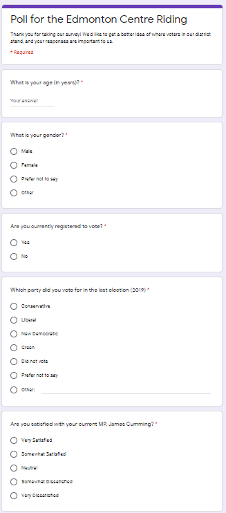

## Executive Summary
The Edmonton Centre Riding, which covers the downtown hub of Edmonton, Alberta, has seen the Liberal and Conservative parties struggle for its control, with election victories consistently alternating between the two parties over the course of the last two decades (ElectionsCanada, 2019). While James Cummings of the Conservative Party won the parliament seat in 2019 with nearly 5000 more votes than Randy Boissonnault of the Liberal Party, the Liberal Party held this parliament seat as recently as 2015, and hopes to regain control (ElectionsCanada, 2019). In preparation for the next election, the Liberal Party hopes to collect information on which voter demographics to target in campaign advertising, by determining how certain groups tend to vote. The results of this survey indicate that there are no gender-related differences in how voters in the Edmonton Centre Riding vote. However, the respondents of this survey were mostly from older generations of voters, suggesting that younger voters may have less interest in the election, voting, and politics overall. While this survey did not collect enough responses from young voters to determine age-related differences in voting in this riding, as younger voters are typically a stronghold of Liberal support (Johnston, 2007), the high age of the respondents to this survey suggests that the Liberal Party may benefit from campaigns aiming to involve a younger generation of voters. While the Liberal Party may not find it worthwhile to target a specific gender, the survey suggests that the Liberal Party may gain increased support from focusing its efforts on increasing young voter engagement.

## Introduction
Alberta, a province largely dominated by the Conservative Party (ElectionsCanada, 2019), contains specific ridings in which the Liberal Party has had moderate success. One of these ridings, the Edmonton Centre Riding, has seen parliament representatives alternate between the Conservative and Liberal Parties over the past two decades. The most recent election in 2019, saw James Cummings of the Conservative Party win the riding with a commanding margin of nearly 5,000 votes (ElectionsCanada, 2019). In an attempt to revive the competitive results previously seen in the riding, and create opportunity for victory in upcoming elections, the Liberal Party has shown a keen interest in learning more about the voter population in the Edmonton Centre Riding. Before campaigning for the 2023 federal election cycle begins, the Liberal Party is interested in finding out if there are certain demographics in the Edmonton Centre Riding that should obtain additional attention and advertising. To this end, the Liberal Party has conducted a survey in the Edmonton Centre Riding, with the intent of analyzing gender-related differences in voting habits. While the survey uncovered little gender-related differences, nearly 95% of the survey respondents were above the age of 40, suggesting that greater care should be given to encourage voter engagement among younger voters. The following figures detail the survey, its results, and the conclusions drawn from these results. 


## Survey Methodology
```{r, include=FALSE}
# Install packages if necessary:
#install.packages(tidyverse)
#install.packages(sn)

# Load packages
library(tidyverse)
library(sn)
```
This survey was interested in responses made by eligible voters living in the Edmonton Centre Riding. The 2016 census indicated there were rougly $95,000$ people living within Edmonton Centre, $89,000$ of which are estimated to be Canadian citizens (StatisticsCanada, 2016). Accounting for population growth over the course of the last four years, we estimated that there are roughly $100,000$ eligible voters in this riding. Given that the Liberal Party has shown particular interest in this riding, we aimed to collect $10,000$ survey responses, equal to $10\%$ of our estimate for the population of interest. To obtain this sample, the survey used the electoral registry, a list of eligible voters in the Edmonton Centre Riding as its sampling frame. As the survey requires a representative sample of eligible voters, a simple random sample without replacement from this registry was used to determine exactly which eligible voters would be a part of the sample. This method allows for collection of a sample with unbiased estimates.

In order to contact the respondents, a link to the survey was sent through whichever preffered method of contact was indicated on the registry: either e-mail or text. If no response was received, a follow-up e-mail or text was sent. While a sample of $10,000$ respondents is ambitious, the Liberal Party was willing to fund the collection of this data given its interest in this riding, and costs were minimized by distributing the survey electronically. However, while electronic distribution minimized cost and increased scale, it also risked higher levels of non-response. To address the issue of non-response, besides sending follow-up e-mails and texts, the survey was also designed in a streamlined and minimilastic way, containing only 5 simple questions. The questions on the survey were as follows:

\begin{align}
\text{What is your age (in years)?}\\
\text{What is your gender?}\\
\text{Are you currently registered to vote?}\\
\text{Which party did you vote for in the last election (2019)?}\\
\text{Are you satisfied with you current MP, James Cumming?}
\end{align}

Despite efforts to minimize systematic non-response however, there appear to be substantial effects of non-response on the results of this survey, as discussed in the next section.


```{r, include=FALSE}
# Set survey size at 10000, roughly 10% of the population in the riding.
survey_size = 10000
```

```{r, include=FALSE}
# Define possible responses to survey questions
gender_responses <- c("Male", "Female", "Didn't Say", "Other")
register_responses <- c("Yes", "No")
party_responses <- c("Conservative", "Liberal", "New Democratic", "Green",
                     "No Vote", "Didn't Say", "Other")
satisfaction_responses <- c("Very Satisfied", "Somewhat Satisfied", "Neutral",
                            "Somewhat Dissatisfied", "Very Dissatisfied")
```

```{r, include=FALSE}
# Create sample survey responses
# Age is skewed normal since voter turnout is highest for those aged 45 and above
# Probabilities for the last vote are roughly based on ElectionsCanada reports
# Satisfaction was sampled with high probability at the extremes
set.seed(304)
survey_responses <- tibble(age = round(rsn(n=survey_size, xi=0, omega=10,
                                           alpha=-2, tau=0, dp=NULL) + 55),
                           gender = sample(gender_responses, survey_size,
                                           replace = TRUE,
                                           prob = c(0.48, 0.48, 0.03, 0.01)),
                           registered = sample(register_responses, survey_size,
                                               replace = TRUE, 
                                               prob = c(0.9, 0.1)),
                           last_vote = sample(party_responses, survey_size,
                                              replace = TRUE,
                                              prob = c(0.374, 0.306, 0.168,
                                                       0.018, 0.120, 0.010, 
                                                       0.004)),
                           satisfaction = sample(satisfaction_responses, 
                                                 survey_size, replace = TRUE,
                                                 prob = c(0.29, 0.11, 0.11, 
                                                          0.15, 0.35)))
```

## Results and Discussion
The following section outlines the results and conclusions drawn from this survey. Figures 1-3 describe the distribution of gender, registration, and age of the respondents, respectively. Specifically, Figure 1 indicates that the number of female respondents was roughly equal to the number of male respondents, and Figure 2 indicates that the overwhelming majority of respondents are registered to vote. 
```{r, echo=FALSE, warning = FALSE, fig.height=3}
# Plot respondemts' gender
ggplot(survey_responses, aes(x=gender)) + 
  geom_bar(fill = "lightblue", color = "black") + theme_minimal() +
  scale_x_discrete(limits = c("Female", "Male", "Didn't Say", "Other")) +
  labs(title = "Figure 1: Gender of Respondents", x = "Gender",
       y = "Number of Respondents")

# Plot respondents' registration status
ggplot(survey_responses, aes(x=registered)) + 
  geom_bar(fill = "lightblue", color = "black", width = 0.5) + theme_minimal() +
  scale_x_discrete(limits = c("Yes", "No")) +
  labs(title = "Figure 2: Registration Status of Respondents",
       x = "Are You Registered?", y = "Number of Respondents")
```

The results displayed in Figure 3 however, indicate that the ages of the respondents are not representative of the ages of eligible voters. While the number of eligible voters in Edmonton Centre is roughly stable for all ages between 18 and 64 (StatisticsCanada, 2016), the respondents' ages are heavily skewed toward older voters. This could possibly suggest a failure in the sampling strategy. However, a more likely explanation is that we received greater numbers of non-response from young voters. As studies show that younger voters tend to hold liberal political views (Johnston, 2007), the observed age distribution therefore poses a problem for the Liberal Party as it suggests minimal political involvement from young voters.
```{r, echo=FALSE, warning = FALSE, fig.height=3}
# Plot respondents' age
ggplot(survey_responses, aes(x=age)) + 
  geom_histogram(bins=15, fill = "lightblue", color = "black") + 
  theme_minimal() +
  labs(title = "Figure 3: Age of Respondents", 
       x = "Age", y = "Number of Respondents")
```

Investigation into gender-related voting differences shows that in the Edmonton Centre riding, there is no difference in how voters of different genders make their decisions. Figure 4 shows the party for which voters cast ballots in the previous federal election. Consistent with the 2019 election results, there are more votes for the Conservative that the Liberal Party (ElectionsCanada, 2019). 
```{r, echo=FALSE, warning = FALSE, fig.height=3}
# Plot repondents' last vote by gender
ggplot(survey_responses, aes(x=last_vote, fill = gender)) + 
  geom_bar(position = position_dodge()) + theme_minimal() + 
  scale_x_discrete(limits = c("Conservative", "Liberal", "New Democratic",
                              "Green", "No Vote", "Didn't Say", "Other")) +
  scale_fill_discrete(name = "Gender") +
  labs(title = "Figure 4: Party Voted for in Previous Election by Gender",
       x = "Party Voted For in Previous Election", y = "Number of Respondents") + 
  theme(axis.text.x = element_text(angle=315))
```

Figure 5 shows respondent satisfaction with the current member of parliament (MP), James Cumming. Again, we see no gender-related differences in satisfaction. However, Figure 5 once again indicates potential problems with non-response, as the majority of respopndents either indicated strong satisfaction or strong dissatisfaction. Typically, respondents are more likely to respond to surveys if they have strong feelings about the contents. While the polarized results shown in Figure 5 do not necessitate their misrepresentativeness, they should be interpreted with caution.

```{r, echo = FALSE, warning=FALSE, fig.height=3}
# Plot respondents' satisfaction with the current MP by gender
ggplot(survey_responses, aes(x=satisfaction, fill = gender)) + 
  geom_bar(position = position_dodge()) + theme_minimal() + 
  scale_x_discrete(limits = c("Very Dissatisfied", "Somewhat Dissatisfied",
                              "Neutral", "Somewhat Satisfied",
                              "Very Satisfied")) +
  scale_fill_discrete(name = "Gender") +
  labs(title = "Figure 5: Satisfaction with Current Representative by Gender",
       x = "Level of Satisfaction", y = "Number of Respondents") + 
  theme(axis.text.x = element_text(angle=315))
```
Overall, the results of this survey indicate that there are no gender-related differences in voting habits in the Edmonton Centre Riding, meaning there is no specific gender that the Liberal Party should be targeting with advertising or campaigning. However, the ages of the respondents suggest that the younger voter population is being underrepresented, certainly in this survey, and possibly during elections as well.

## Survey Weaknesses and Next Steps
As the survey was focused specifically on discovering gender-related differences in voting while maximizing simplicity, there was insufficient data collected to make concerete claims about age-related voter behaviour. Coupled with non-response from young, as well as moderate voters, the results are not perfectly representative. Nonetheless, the survey has provided asnwers to questions important in determining the next steps as the Liberal Party moves forward with campaigning for the 2023 election. Specifically, the Liberal Party should abandon ideas of advertisments targeted towards a specific gender, and instead focus its efforts on increasing the involvment and participation of younger voters. While a direct link between increasing young voter turnout and the success of the Liberal Party in the Edmonton Centre Riding has not been established, further investigation into age-related voting habits in this area may prove fruitful for the Liberal Party.

## Appendix
_The survey can be found at the following link: \underline{\url{https://forms.gle/Kjzwuzid8BVyYpn18}}_

_The code and analysis of the survey results can be found at the following link: \underline{\url{https://github.com/imehrlich/STA304}}_

An image of the survey in its entirety can be seen below:

```{r pressure, echo=FALSE, fig.cap="Figure 6A: Image of the Survey", out.width = '100%', fig.align="center"}

```
\newpage

## References
Azzalini, A. (2020). The R package 'sn': The Skew-Normal and Related Distributions such as the Skew-t
  (version 1.6-2). \url{http://azzalini.stat.unipd.it/SN}

ElectionsCanada. (2019). October 21, 2019 Federal Election Results. Government of Canada. Retrieved from \url{enr.elections.ca/ElectoralDistricts.aspx?lang=e}

Johnston, Richard, J. Scott Matthews, and Amanda Bittner. "Turnout and the party system in Canada, 1988-2004." Electoral Studies 26.4 (2007): 735-745.

R Core Team (2019). R: A language and environment for statistical computing. R Foundation for Statistical
  Computing, Vienna, Austria. URL https://www.R-project.org/.
  
StatisticsCanada. (2016). Edmonton Centre Federal Election Districs Census Profile. Retrieved from \url{https://www12.statcan.gc.ca/census-recensement/2016/dp-pd/prof/details/page.cfm?Lang=E&Geo1=FED&Code1=48014&Geo2=PR&Code2=48&SearchText=Edmonton%20Centre&SearchType=Begins&SearchPR=01&B1=All&GeoLevel=PR&GeoCode=48014&TABID=1&type=0}

Wickham et al., (2019). Welcome to the tidyverse. Journal of Open Source Software, 4(43), 1686,
  \url{https://doi.org/10.21105/joss.01686}
  